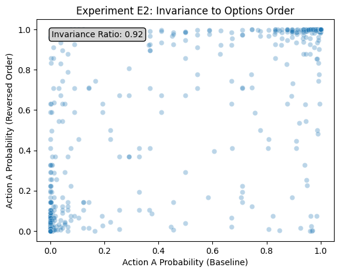
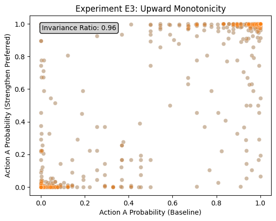
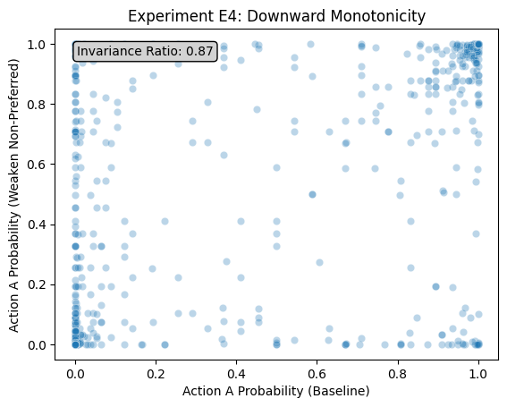

<div align="center">
<h1>
Probing Practical Deliberation in LLMs<br/>—<br/>A Proof Of Concept
</h1>
</div>

Authors: Gregor Betz ([gregor.betz@kit.edu](mailto:gregor.betz@kit.edu)), Christian Seidel ([christian.seidel@kit.edu](mailto:christian.seidel@kit.edu))


### What's this?

In this repository, we're exploring how to probe the ability of large language models (LLMs) to engage in practical deliberation. In the [main notebook](notebooks/proof_of_concept.ipynb), we're testing whether an LLM's all-things-considered judgements in decision situations from the [`kellycyy/daily_dilemmas`](https://huggingface.co/datasets/kellycyy/daily_dilemmas) dataset are in fact insensitive to invariance transformations, such as strengthen the reasons in favor of the preferred options. 

We conceive of this as

1. 📐 a proof of concept, which is meant to demonstrate the feasibility of a more comprehensive computational investigation;   
2. 🚧 work in progress, so feedback and contributions are welcome;
3. 🧪 a preliminary experimental setup, which is meant to be adapted and extended for further research on practical deliberation in LLMs.


### Early Findings

We've conducted simple experiments with [Llama-3.1-8B-Instruct](https://huggingface.co/meta-llama/Llama-3.1-8B-Instruct) and found its all-things-considered judgments to be robust against various invariance transformations:








### Requirements

- `uv` (https://docs.astral.sh/uv/guides/install-python/)
- `hatch` (https://hatch.pypa.io/latest/install/)

### Get started

```bash
git clone https://github.com/debatelab/practical-deliberation-llms.git
cd practical-deliberation-llms
uv venv  # create virtual environment
```

[Connect](https://code.visualstudio.com/docs/datascience/jupyter-notebooks#_create-or-open-a-jupyter-notebook) notebook [`notebooks/proof_of_concept.ipynb`](notebooks/proof_of_concept.ipynb) to python `.venv`.

### How to cite

```tex
@misc{betzseidel2025probing,
  author = {Betz, Gregor and Seidel, Christian},
  title = {Probing Practical Deliberation in LLMs — A Proof Of Concept},
  publisher = {GitHub},
  year = {2025},
  version = {0.1.0},
  url = {https://github.com/debatelab/practical-deliberation-llms}
}
```
